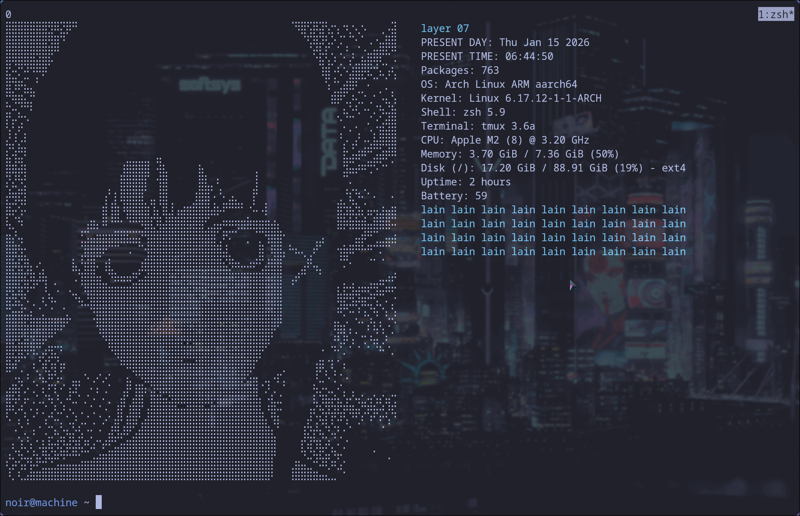

# .dotfiles


```
GRUB_CMDLINE_LINUX_DEFAULT="apple_dcp.show_notch=1"
```
in */etc/default/grub*<br>
Enables use of the notch area on Apple Silicon Macs under Asahi Linux, allowing the display to extend behind the notch so windows can occupy the full panel height.
